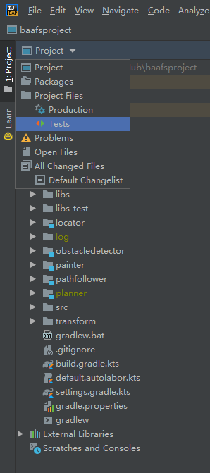
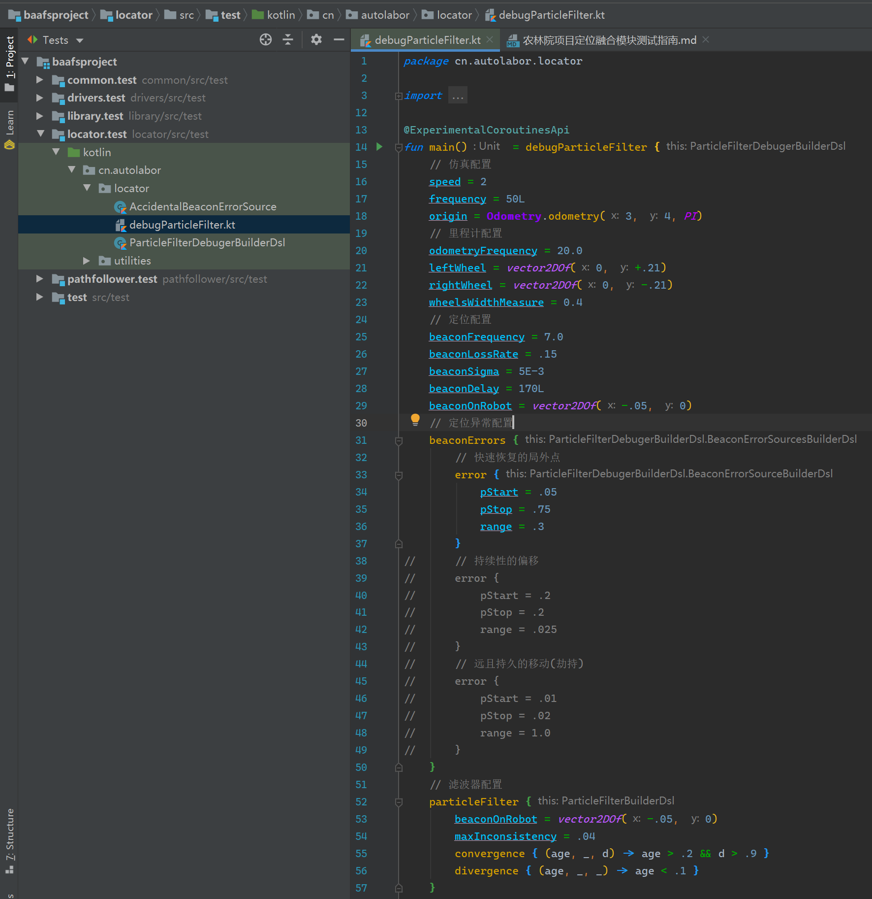
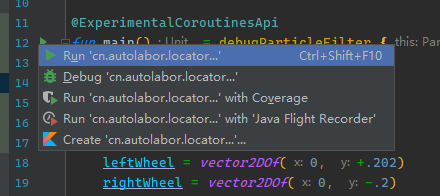

# 农林院项目定位融合模块测试指南

## 摘要

* 本文可能对下列人士有所裨益：
  * 项目开发人员
  * 项目测试人员
  * 其他软件工程师
  * 对融合算法实现、功能、效果有兴趣的人士
  * 对 Kotlin 语言有兴趣的人士
  * 对 Gradle 工程有兴趣的人士

* 本文可为读者的下列工作提供帮助：
  * 安装 JVM 环境
  * 安装 Jetbrains IDEA 集成开发环境并维持更新
  * 构建农林院项目 Gradle 工程
  * 测试其中的定位融合模块

## 目录

* [准备工作](#准备工作)
* [运行测试](#运行测试)
* [kotlin DSL 脚本](#kotlin-DSL-脚本)
* [调参](#调参)
* [自定义数据分析](#自定义数据分析)

## 准备工作

* **此节需要读者连接到互联网才可完成。**

* **准备工作即安装环境，暂时仅以 Windows 为例。**

* **视读者网络状况和计算机性能差异，完成此节可能需要数分钟分钟到数小时不等，且中断无法恢复，请读者妥善安排时间。**

以下各步骤可同时进行以节约时间：

* 安装 JVM

  **至少需要 JDK8，建议 JDK11 以上，最新为 JDK13。**

  此处以 JDK13 为例，安装旧版本 JDK 可能需要登录 Oracle 账号。

  1. 访问[Oracle JDK 下载页](https://www.oracle.com/technetwork/java/javase/downloads/jdk13-downloads-5672538.html)，翻到最下方

  2. 点击 `接受许可协议（Accept License Agreement）`

  3. 点击 `jdk-13.0.1_windows-x64_bin.exe` 开始下载

     > 挂起点：等待下载期间可进行其他工作

  4. 运行 `jdk-13.0.1_windows-x64_bin.exe` 安装 JDK

     > 挂起点：等待安装期间可进行其他工作

     > **使用 IDEA 则不必配置 JAVA 环境变量**

* 通过 Jetbrains toolbox 安装 IDEA

  > **强烈推荐使用 toolbox 获得最佳使用体验！**
  >
  > **强烈推荐使用 toolbox 获得最佳使用体验！**
  >
  > **强烈推荐使用 toolbox 获得最佳使用体验！**

  1. 访问 [Jetbrains toolbox 下载页面](https://www.jetbrains.com/toolbox-app/)

  2. 下载 Jetbrains toolbox

     > 挂起点：等待下载期间可进行其他工作

  3. 安装 Jetbrains toolbox

     > 挂起点：等待安装期间可进行其他工作

     > 安装完成后，toolbox 图标将出现在任务栏右下角，视 Windows 设置，可能被折叠

  4. 接收软件内许可协议，在 `Tools` 选项卡中找到 `Intellij IDEA Community` 安装

     > 挂起点：等待安装期间可进行其他工作

* *可选* 安装 Github Desktop

  1. 访问[下载页](https://desktop.github.com/)

  2. 下载并安装

     > 挂起点：等待下载期间可进行其他工作

     > 挂起点：等待安装期间可进行其他工作

  3. 登录 Github 账号

* 使用 git 获取工程源码

  > 非工程人员可能还需要安装 [git](https://git-scm.com/downloads)，步骤略，安装时不懂的选项直接下一步即可

  > 强烈反对初学者使用命令行 git，可使用 Github Desktop 或使用 IDEA 内置的图形 git

  * 远程仓库路径：https://github.com/autolaborcenter/baafsproject.git

* 使用 IDEA 打开项目

  > 建议完成以上全部步骤之后再进行此步骤。

  * 在 IDEA 中 open project，选择本地仓库路径

    或

  * 在 IDEA 中 get from version control，输入远程仓库路径

  > 初次使用 Gradle 需要下载，视网络环境，最长可能需要数十分钟，科学上网可一定程度加快

  > 挂起点：至此已准备工作所有操作已完成，读者可 leave your computer alone

  等待，直到：

  * IDEA 状态栏不再有会动的东西
  * 左侧出现 `Project` 选项卡，`baafsproject` 目录下出现 10+ 个子目录或文件
  * 右侧出现 `Gradle` 选项卡

  准备工作全部完成。

## 运行测试

* 切换项目到测试视图



* 打开测试脚本

  

* 运行测试脚本

  

* 等待下方 `Run` 选项卡中控制台打印分析日志

  ```bash
  调试粒子滤波器 opened 1 networks on /233.33.33.33:23333
  时间 = 0.040 | 误差 = 0.000
  时间 = 0.080 | 误差 = 0.000
  时间 = 0.120 | 误差 = 0.000
  时间 = 0.160 | 误差 = 0.000
  时间 = 0.240 | 误差 = 0.000
  时间 = 0.280 | 误差 = 0.000
  时间 = 0.320 | 误差 = 0.000
  时间 = 0.360 | 误差 = 0.000
  时间 = 0.440 | 误差 = 0.000
  时间 = 0.480 | 误差 = 0.000
  ...
  ```

## kotlin DSL 脚本

> 对 kotlin DSL 有兴趣可参考[此文章](https://www.jianshu.com/p/f5f0d38e3e44)。建议先不要深究定义和原理，先看下面的简介和使用方法。

### 领域特定语言

DSL（Domain Specific Language，领域特定语言），是专用于描述或解决特定问题的语言分类。

> 又叫领域专用语言。这种按功能设定的语言分类，类似的还有通用编程语言、硬件描述语言（HDL），硬件描述语言也可以算做领域特定语言的一类。

领域特定语言因为只用于解决特定问题，可以有选择地屏蔽大量用不上的语法结构，使语句简明，风格一致，大大降低开发和维护的心智成本。但若为每个特定问题创立一种语言，未免太过繁琐，自定义解释器的开发成本也太高，还会丧失通用开发环境带来的静态分析、调试器等便利。因此，若能用通用编程语言随时构造领域特定语法结构，就能同时享受双方的优势。

Kotlin 在语言设计层面就考虑到这些需求，其标志性的简洁 Lambda 语法和扩展方法机制为 DSL 带来了极大的便利。

我为各模块和其调试器都提供了 DSL 配置，方便各界人士不必了解实现、参数顺序和类型等细节，即可享受调参的乐趣。

## 调参

### 程序结构

下面的代码段启动了一个定位融合调试器：

```kotlin
@ExperimentalCoroutinesApi
fun main() = debugParticleFilter { ... }
```

## 自定义数据分析

> TODO

